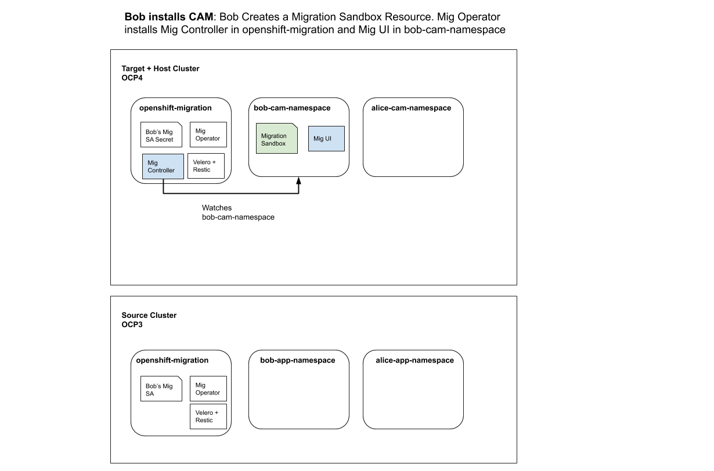

# Cluster Application Migration (CAM) Non-Admin Design

This enhancement will allow for a non cluster-admin to migrate applications using the CAM operator.

## Release Signoff Checklist

- [ ] Enhancement is `implementable`
- [ ] Design details are appropriately documented from clear requirements
- [ ] Test plan is defined
- [ ] Graduation criteria for dev preview, tech preview, GA
- [ ] User-facing documentation is created in [openshift-docs](https://github.com/openshift/openshift-docs/)

## Open Questions [optional]

 > 1. Can tenant-scoped operators somehow make this design simpler? 

## Summary

CAM will be updated to allow a user to install a namespaced version of the CAM
UI for a user to interface with in order to create migration resources in their
local namespace. The CAM UI+API will be updated to allow a user to supply their
identity token(Oauth or SA token) to the source and destination clusters to
CAM. These identity tokens will be used in RBAC authorization to determine what
permissions the user has on the source and destination clusters so CAM will
know what namespaces the user is able to migrate.

## Motivation

Currently only cluster-administrators can use CAM. This is not not desired
because there are different migration needs between a cluster-admin and an
application owner.

### Goals

- Immediate design needs to support OCP3 -> OCP4 migrations as the considered source and destination clusters
- Leave the door open to support vanilla Kubernetes installations as the source/destination/host clusters
- Support ability for user to select a list of migration namespaces they control on the source cluster through the CAM API

### Non-Goals

- Support API selection more granular than namespaces

## Proposal

In order to solve this problem, there are 3 major points in our current design
of CAM that need to be discussed and addressed:

1. The `mig` service account which is used to perform migrations on the source
   and destination is currently configured to run as cluster-admin. We
   initially chose cluster-admin because we could not know ahead of time what
   exactly the migration tool would need to modify on the cluster prior to
   running the backup. These permissions should be scoped and defined in a
   role+rolebinding (cluster scoped) which can be granted to a service account.
   The needed permissions would be what is needed to quiesce the applications
   on the source (modifying deployments/dcs/daemonsets/etc) and to create stage
   pods for the stage workflow. The main open question around this is whether
   the discovery service will require `cluster-admin` rights to index all of
   the needed resources for RBAC authorization.
1. CAM is currently installed as a singleton. In order to support multiple
   non-admin users there will need to exist a way for a user to install a
   namespaced scoped version of CAM. These details will be fleshed out below.
1. The discovery service will be updated to support RBAC-based authorization.
   For the full details on this please see the linked document, however the
   relevant point here is that the discovery service can take a user’s identity
   token and return the list of namespaces the user has access to on the source
   cluster. The discovery service controller will be responsible for acting as
   the gatekeeper that checks what namespaces the user has access to on the
   source cluster. If the user creates a migration plan which contains
   namespaces that the supplied identity token does not have access to, the
   migration plan should fail validation as caught by the discovery
   service+migration controller.

There are a few major components that will need to be updated to support this
work. I will break down the required changes for each component:

#### Migration Operator

For the current design, there will exist one operator running in
`openshift-migration`. For an alternative approach, please see OLM
OperatorGroup Integration below.

There will be a new Custom Resource Definition introduced to CAM called
`MigrationSandbox` which will define a namespaced installation of CAM.  The
operator will be changed to watch ALL namespaces for the creation of this CR.
In the current design, when a MigrationSandbox is created in namespace `Foo`,
the operator will install a namespaced Migration UI in namespace `Foo`. A new
Migration Controller will be deployed in `openshift-migration` which will be
watching namespace `Foo` for the creation of Migration Resources.

The Controller needs to run in `openshift-migration` due to the fact that it
will be using the elevated permissioned service account for both the source and
destination clusters. If this controller ran in the user's namespace, we have
broken the security model since the user could exec into the pod and gain
access to this service account.

#### Migration Controller

The migration controller needs to run in `openshift-migration` since it will
contain access to the Mig SA token. We must not allow the user to be able to
exec into the controller pod and escalate their privileges.

The controller’s migplan controller will need to be updated to validate that
the list of namespaces selected on the migplan do not include namespaces which
a user does not have access to migrate. 

##### Authorization

SAR checks will be used to determine whether or not a user has access to
migrate a specific namespace. In order to present a list of namespaces to the
user, a SAR check can be done to determine if the user has `get` access on a
given namespace. The equivalent CLI command for this would be:
```
$ oc auth can-i get project -n <namespace>
```

Prior to running the actual migration, the plan controller should run
additional SAR checks to ensure that the user has the required permissions for
every action the migration controller will take on the given namespace. This
includes:
* scaling down deployments/replicasets/etc (quiescing applications)
* creating/updating pods (for stage pods/labels/annotations)
* listing PVCs (for storage selection)
* etc.


##### Authorization - Cluster-Scoped resources

It's worth noting that cluster scoped resources are an exception to the rule
here. A great example in this case are Persistent Volumes. In general, a user
doesn't have the ability to list Persistent Volumes in a cluster and for that
matter they cannot mutate them. The migration controller + Velero will mutate
Persistent Volumes and needs the ability to list and introspect them to perform
a good user experience. We need to determine whether this will be acceptable
for CAM to interact with PVs that are consumed by a user's owned PVC, or
whether additional permissions will need to be granted to the user.

For CAM in the PV case, I think it makes sense to see if a user can *update*
PVCs in the given namespace, and if they have the proper permissions to do
this, we can assume that it is safe to copy the data off a PV or in the move
case, to change the `ReclaimPolicy`.

There is 2 potential approaches that we can take for the non-admin design in
terms of handling of cluster-scoped resources *other* than Persistent Volumes.
A good example of a cluster-scoped resource we handle today that a regular user
doesn't have access to is SCCs. I believe that we could follow a similar
pattern to what we used in the past with the Ansible Service Broker to expose a
configuration option `autoEscalate` which would enable our plugins to pick up
cluster-scoped resources given that a namespace scoped resource the user has
access to depends on it. Otherwise, every other cluster-scoped resource that
the user cannot *get* (which will be checked via SAR check) will not be
included in the backup. This can be controlled easily via the plugin.

### User Stories [optional]

With this feature, a normal OpenShift user who only has elevated permissions
inside of namespaces they control will be able to consume CAM and migrate
applications across clusters.

Currently, CAM is restricted to only be used by users with cluster-admin access
to both the source and destination cluster. The new approach will use Bob's
identity tokens on the source and destination clusters to determine what Bob
can migrate.

### Implementation Details/Notes/Constraints [optional]

What are the caveats to the implementation? What are some important details that
didn't come across above. Go in to as much detail as necessary here. This might
be a good place to talk about core concepts and how they relate.

### Risks and Mitigations

The risks of implementing this is if a user Bob is capable of migrating
resources that he does not have proper access to on the source or destination
clusters. Since a migration includes a backup and a restore on the respective
clusters, Bob is performing privileged operations that should require some form
of authorization of the targeted resources before performing the operation.

In order to mitigate this, we are ensuring the design is vetted by the
appropiate teams that can ensure we are doing what is normal practice in other
OCP items like the `projects` API.

## Design Details

### Test Plan

**Note:** *Section not required until targeted at a release.*

Consider the following in developing a test plan for this enhancement:
- Will there be e2e and integration tests, in addition to unit tests?
- How will it be tested in isolation vs with other components?

No need to outline all of the test cases, just the general strategy. Anything
that would count as tricky in the implementation and anything particularly
challenging to test should be called out.

All code is expected to have adequate tests (eventually with coverage
expectations).

### Graduation Criteria

**Note:** *Section not required until targeted at a release.*

Define graduation milestones.

These may be defined in terms of API maturity, or as something else. Initial proposal
should keep this high-level with a focus on what signals will be looked at to
determine graduation.

Consider the following in developing the graduation criteria for this
enhancement:
- Maturity levels - `Dev Preview`, `Tech Preview`, `GA`
- Deprecation

Clearly define what graduation means.

#### Examples


##### Setup

Source cluster is OCP3, target cluster is OCP4 and the target cluster is also
the host cluster.

##### Workflow

1. Mig operator is installed via cluster-admin by OLM in `openshift-migration`
   namespace on target/source/host clusters. `openshift-migration` namespace
   should be only accessible by the cluster-admin.
  1. Operator sets up `mig` service accounts on each cluster in
     `openshift-migration` with a rolebinding which grants that service account
     all the permissions required to perform a migration.
1. The cluster-administrator creates secrets in `openshift-migration` which
   contains the SA token of the mig service account for both the source and
   target cluster. (In this example, since the target is the host cluster this
   will be configured for the cluster-admin, so he only needs to create the one
   secret).
1. The cluster-administrator then grants Bob “USE” on these created secret(s)
   that contain the service account token for each cluster.
   1. Admission webhooks can be used during migplan (see later) creation to
      validate Bob is using a secretRef that was granted to him by a
      cluster-admin without the ability to actually read the secret. This also
      prevents another user Alice from simply being able to guess Bob’s
      secretRef.
   1. https://kubernetes.io/docs/reference/access-authn-authz/extensible-admission-controllers/
   1. **Note:** This check is not sufficient to determine user escalation
      because this only tells the controller that a cluster administrator has
      granted Bob the ability to perform migrations. This grants Bob the
      ability to create Velero resources on the cluster. If Bob had full access
      to the Velero API, Bob could backup/restore resources he does not have
      access to. This is why the additional identity token needs to be used to
      prevent Bob from creating a migration plan with namespaces he does not
      have access to.
1. The cluster-administrator then creates a MigCluster resource in
   `openshift-migration` which includes the usual spec fields:
   1. Mig SA Secret Ref
   1. Cluster coordinates
   
#####   Figure 1: Installation of CAM Operator and cluster-admin Setup
   
#####   Figure 2: Cluster Admin creates MigCluster Resource
6. Bob creates a MigrationSandbox resource which will trigger the operator to
   provision a new migration controller in openshift-migration namespace that
   watches only Bob’s namespace (where the MigrationSandbox resource was
   created). It also provisions and configures a Migration UI instance in Bob’s
   namespace.
7. Bob creates secret(s) containing identity tokens for the source (and
   optionally the target) cluster in bob-cam-namespace.
   
#####   Figure 3: Bob installs CAM into a namespace He is an Admin of
8. Bob then interfaces with the Migration UI to create a MigPlan resource with
   the following:
   1. secretRef to Mig SA token Bob has been granted “USE”
   1. user identity token secretRef
   1. List of namespaces Bob wishes to migrate
9. MigPlan is validated by checking that Bob has been granted “USE” on the
   given secret and runs through the permissions check using the discovery
   service to get the list of valid projects for Bob to migrate using Bob’s
   identity token.
   1. The migplan controller validates that the list of namespaces is a subset
      of the namespaces validated with the migcluster.
   
#####   Figure 4: Bob creates a valid Mig Plan
   
#####   Figure 5: Bob creates an invalid Mig Plan
10. At this point, Bob has a “Ready” migcluster, a “Ready” migplan, and now can
   create a migmigration. The migmigration needs to perform the validation
   check one more time prior to running the migration.

##### Dev Preview -> Tech Preview

- Ability to utilize the enhancement end to end
- End user documentation, relative API stability
- Sufficient test coverage
- Gather feedback from users rather than just developers

##### Tech Preview -> GA 

- More testing (upgrade, downgrade, scale)
- Sufficient time for feedback
- Available by default

**For non-optional features moving to GA, the graduation criteria must include
end to end tests.**

##### Removing a deprecated feature

- Announce deprecation and support policy of the existing feature
- Deprecate the feature

### Upgrade / Downgrade Strategy

To handle the upgrade use case, CAM must not break the existing cluster-scoped
installation use case of CAM. To do this, a new Custom Resource will be
introduced that will be used only for namespace-scoped installations of CAM.
The operator will be updated with a new playbook that will perform the
namespaced installation on creation of the `MigrationSandbox` resource.

The `MigrationController` CR which indicates a cluster-scoped install of CAM
will be locked down via a set of RBAC resources which will only allow the
privileged admin to create it. This will allow an admin to create the
`MigrationController` resoruce in `openshift-migration`, but prevent Bob from
being able to create a `MigrationController` in namespace `Foo`.

If a user has CAM 1.1 installed and upgrades to CAM 1.2 then they will be
unaffected as their `MigrationController` CR will still imply a cluster-scoped
install of CAM. If the user creates a `MigrationSandbox` resource while also
having a cluster-scoped install of CAM, the operator will leave the
cluster-scoped install of CAM alone while provisioning the needed resources for
the namespaced-install.

The operator should be capable of updating/reverting the two types of
installations when the configuration parameter is changed.

### Version Skew Strategy

How will the component handle version skew with other components?
What are the guarantees? Make sure this is in the test plan.

Consider the following in developing a version skew strategy for this
enhancement:
- During an upgrade, we will always have skew among components, how will this impact your work?
- Does this enhancement involve coordinating behavior in the control plane and
  in the kubelet? How does an n-2 kubelet without this feature available behave
  when this feature is used?
- Will any other components on the node change? For example, changes to CSI, CRI
  or CNI may require updating that component before the kubelet.

## Implementation History

Major milestones in the life cycle of a proposal should be tracked in `Implementation
History`.

## Drawbacks

The idea is to find the best form of an argument why this enhancement should _not_ be implemented.

## Alternatives

Similar to the `Drawbacks` section the `Alternatives` section is used to
highlight and record other possible approaches to delivering the value proposed
by an enhancement.

## Infrastructure Needed [optional]

Use this section if you need things from the project. Examples include a new
subproject, repos requested, github details, and/or testing infrastructure.

Listing these here allows the community to get the process for these resources
started right away.
